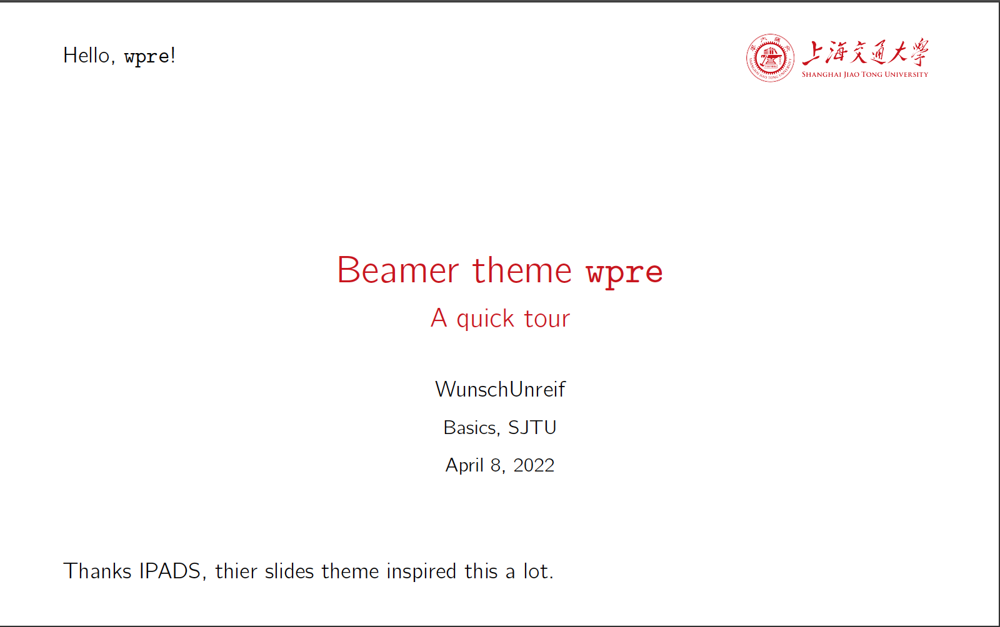
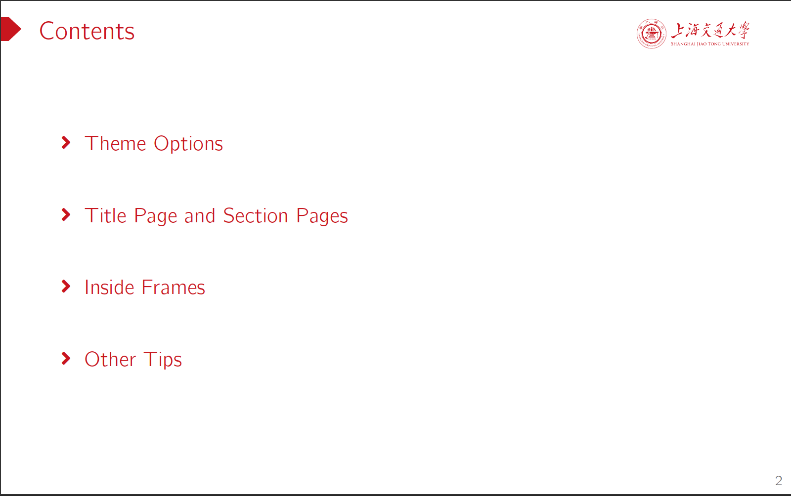
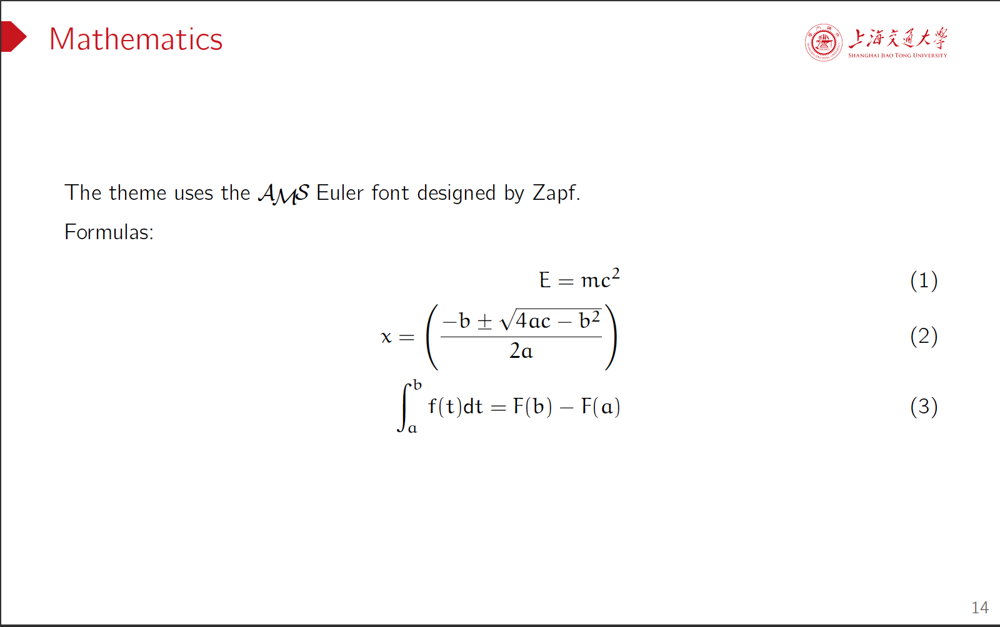
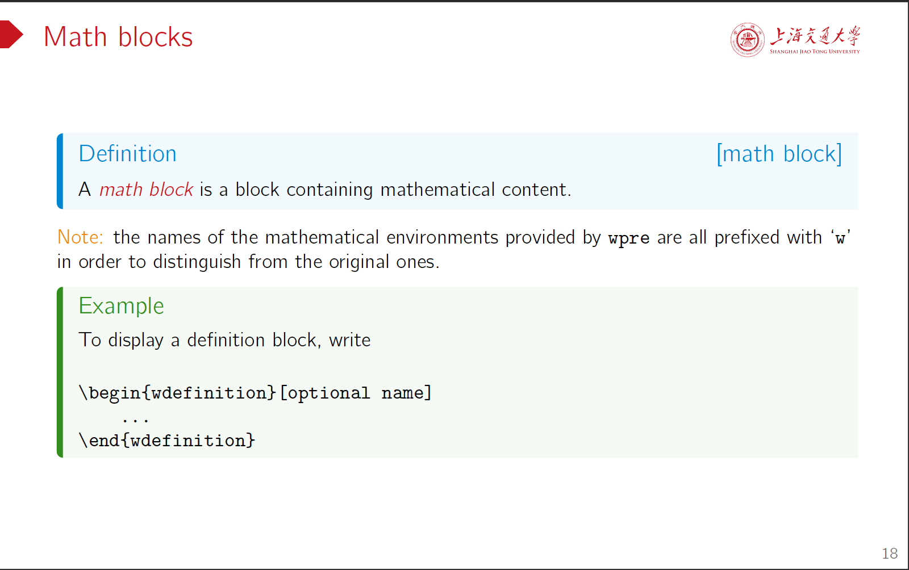
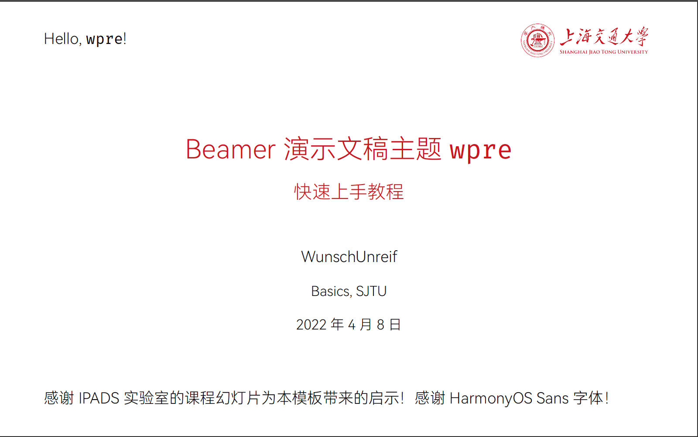
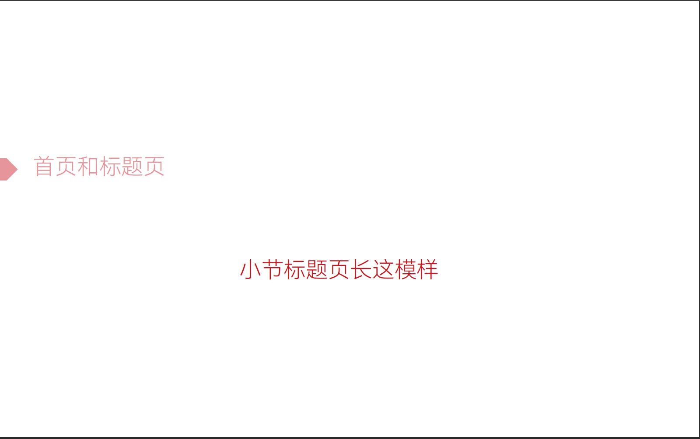
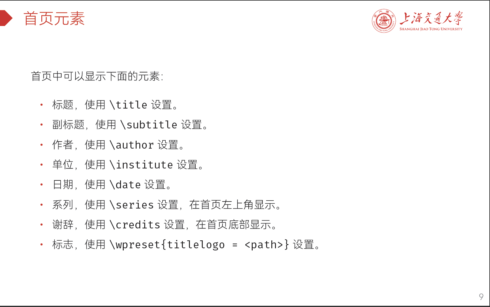
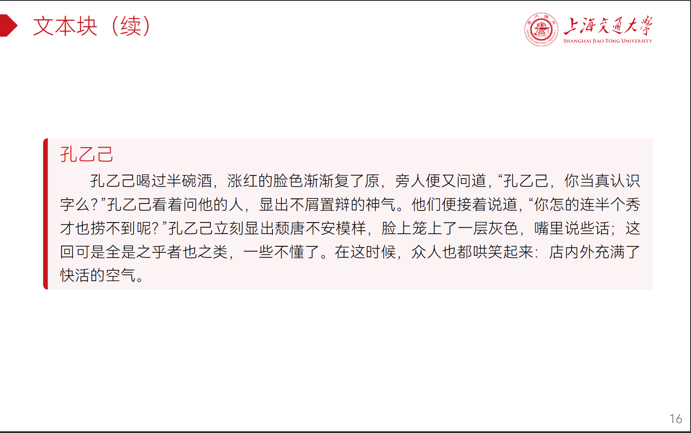

# `wpre`

`wpre` 是一个 Beamer 演示文稿主题，采用上海交通大学标准色作为配色方案，页面版式很大程度上受到了 [IPADS 实验室](https://ipads.se.sjtu.edu.cn/)课程幻灯片风格的启发。

[`demo-zh`](demo-zh/) 和 [`demo-en`](demo-en) 中分别提供了中英文使用样例以及参考说明。

## 演示文稿截图

### 英文

<div width="100%" style="display:flex; justify-content: space-between;">
    <div style="width: 49%"></div>
    <div style="width: 49%"></div>
</div>
<div width="100%" style="display:flex; justify-content: space-between;">
    <div style="width: 49%"></div>
    <div style="width: 49%"></div>
</div>

### 中文

<div width="100%" style="display:flex; justify-content: space-between;">
    <div style="width: 49%"></div>
    <div style="width: 49%"></div>
</div>
<div width="100%" style="display:flex; justify-content: space-between;">
    <div style="width: 49%"></div>
    <div style="width: 49%"></div>
</div>

## 安装说明

以 `*nix` 上的 `texlive` 环境为例。

1. 克隆代码仓库

    ```bash
    cd ~
    mkdir texmf
    cd texmf
    git clone --recurse-submodules https://github.com/WunschUnreif/Latex-Templates.git
    ```

2. 添加下面两个环境变量

    ```bash
    export TEXINPUTS=".:~/texmf//:"
    export TTFONTS=".:~/texmf//:"
    ```

3. 在`tex`源代码中加入`\usetheme{wpre}`，并使用 `xelatex` 编译。
